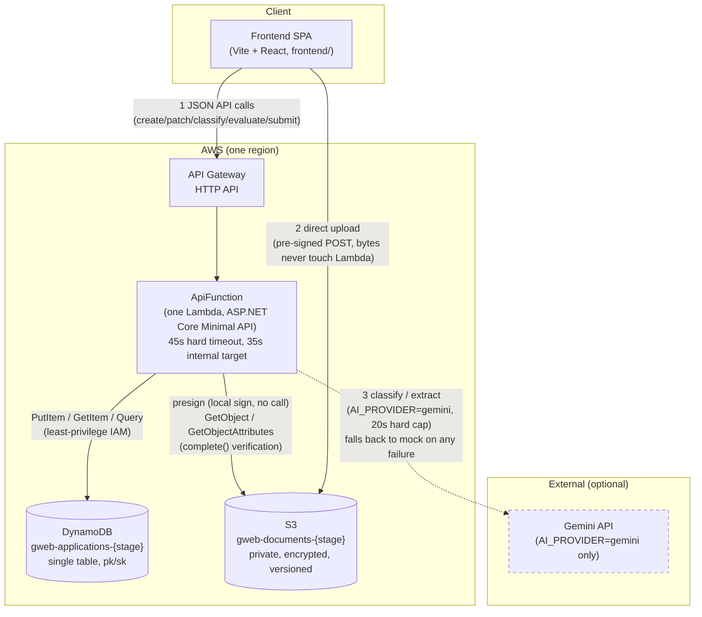

# Architecture

GWEB Merchant Onboarding & Underwriting Intake Layer — one diagram, request flow,
storage, external calls, timeouts/retries, and failure states. See
[`README.md`](../README.md) for setup and API examples, and `docs/adr/` for the design
decision behind every choice named here.

## Diagram

Numbered edges show the three distinct traffic shapes: **(1)** every ordinary API call
goes through Lambda; **(2)** document bytes never pass through Lambda at all — the
client uploads directly to S3 using a URL Lambda only *signs*; **(3)** the AI call is
optional, capped independently of the rest of the request budget, and never blocks a
response if it fails — `MockEvaluationProvider` (default, in the diagram implicitly
always available) stands in.

## Request flow

Every request enters through API Gateway's HTTP API and is proxied whole (`$default`
route, `ANY` method) to the one Lambda function hosting the entire ASP.NET Core Minimal
API app (`Amazon.Lambda.AspNetCoreServer.Hosting`) — a deliberate deviation from
one-Lambda-per-route, justified in
[`docs/adr/0001-runtime-and-language-choice.md`](adr/0001-runtime-and-language-choice.md).
Inside the Lambda, `RequestExecution.RunAsync` (used by every endpoint handler) is the
one place a `DeadlineBudget` is created from the real `ILambdaContext.RemainingTime`
(or a local-dev fallback constant outside Lambda) and threaded down explicitly through
every call that does I/O — never re-derived, never a fresh ad-hoc timeout at the call
site. See "Timeouts, retries, and failure states" below.

## Data flow: DynamoDB

Single-table design (`gweb-applications-{stage}`, partition key `pk = APP#{applicationId}`,
sort key `sk` varying by aggregate member: `META`/`Application`, `PERSON#APPLICANT`,
`BUSINESS`, `DOC#{documentId}`, `MCC_CLASSIFICATION`, `EVALUATION`). Full access-pattern
table and the single- vs. multi-table tradeoff:
[`docs/adr/0003-dynamodb-table-strategy.md`](adr/0003-dynamodb-table-strategy.md).
Every write is a version-conditional `PutItem` (`attribute_not_exists(pk)` on create,
`version = :expectedVersion` on update) — optimistic concurrency, never a silent
overwrite, and the same mechanism makes a client's retry after a timeout safe (see
below). No entity's blob/PDF/image bytes are ever written here — see S3, next.

## Data flow: S3 documents

The client requests a pre-signed **POST** (not PUT — only a presigned POST can enforce
a `content-length-range` condition; see `S3DocumentStorage.cs`) from
`POST .../documents/presign`, then uploads the actual file bytes **directly to S3**,
never through Lambda. `POST .../documents/{id}/complete` re-verifies what actually
landed (checksum via `ChecksumMode.ENABLED`, plus a 16-byte ranged read for a
file-signature/magic-byte check) as defense in depth on top of the S3 policy
conditions, and is idempotent. Bucket is private (`BlockPublicAcls`/`BlockPublicPolicy`/
`IgnorePublicAcls`/`RestrictPublicBuckets` all `true`), encrypted at rest (`AES256`,
S3-managed keys — see `docs/SECURITY.md` for the KMS tradeoff), and versioned. Verified
for real against MinIO (a local S3-compatible target), not simulated — see
[`docs/adr/0010-frontend-architecture.md`](adr/0010-frontend-architecture.md).

## External calls: AI evaluation

`IEvaluationProvider` has two implementations: `MockEvaluationProvider` (default,
deterministic, offline — no network call, reuses real catalog search results) and
`GeminiEvaluationProvider` (real HTTP calls to the Gemini API, only when
`AI_PROVIDER=gemini` and a key is configured). Both are grounded against the real MCC
catalog — a hallucinated code is dropped even if a model ignores its instructions.
`ClassificationService`/`EvaluationService` catch any failure from the primary provider
and retry once against the mock, labelling the result `"provider": "mock"` — a caller
always gets a usable, honestly-labelled result, never a raw upstream failure. Full
design: [`docs/adr/0006-ai-evaluation-provider.md`](adr/0006-ai-evaluation-provider.md),
[`docs/adr/0007-rate-evaluation-and-risk-signals.md`](adr/0007-rate-evaluation-and-risk-signals.md).

## Timeouts, retries, and failure states

- **The 45-second rule.** `DeadlineBudget.HardCeilingMs = 45_000` is a fixed constant
  (a contract with the caller, not a tuning knob); the internal target defaults to
  `35_000` (configurable, `DEADLINE_TARGET_MS`), leaving headroom for cleanup and
  response serialization. The Lambda's own `Timeout: 45` (in `infra/template.yaml`) is
  a backstop in case application-level deadline logic ever fails to self-terminate —
  under normal operation every request returns well before it.
- **Every outbound call is budget-derived, not independently timed.** All three
  external-call classes (DynamoDB, S3, Gemini) route through a small `*CallExecutor`
  that derives a real per-call timeout from `DeadlineBudget.ForCall(reserve, perCallMax)`
  and applies it with a linked `CancellationTokenSource` — audited end-to-end in Phase
  10 with no gaps found (`docs/adr/0009-deadline-hardening-and-retry.md`). Gemini gets
  an additional hard 20-second cap independent of remaining budget, because this
  model's real-world latency (confirmed live) sometimes approaches the 35s internal
  target on its own.
- **Bounded retry with backoff + jitter.** `Gweb.Shared.Resilience.BoundedRetry`
  (exponential backoff, full jitter, budget-aware — never retries past what remaining
  budget can afford) is wired into the Gemini adapter only. DynamoDB and S3
  deliberately do **not** get a second app-level retry layer: the AWS SDK for .NET
  already retries transient failures on those internally, and stacking an
  uncoordinated retry loop on top would risk retry amplification rather than add
  safety — see `docs/adr/0009-deadline-hardening-and-retry.md` for the full reasoning.
- **Structured timeout/failure responses.** `HttpErrorMapper` turns
  `DependencyTimeoutException` into `504 DEPENDENCY_TIMEOUT` and
  `DependencyUnavailableException` into `503 DEPENDENCY_UNAVAILABLE`, both carrying
  `"retryable": true` in the JSON body — a machine-readable signal for whether the
  caller's *own* retry (above this system) is worthwhile. No stack trace, table name,
  bucket name, or ARN is ever forwarded to a client; those go to CloudWatch only, keyed
  by correlation ID.
- **Safe retry / no partial state.** Every write is the version-conditional `PutItem`
  described above, which is atomic at the DynamoDB level — a client-observed timeout on
  a write means the condition either committed or it didn't, never a partial state. A
  retried request with the same `expectedVersion` is therefore naturally idempotent:
  if the original write landed, the retry gets a clean `409 CONFLICT`; if it didn't,
  the retry succeeds normally.
- **Async fallback when the budget can't be met.** `POST .../evaluate` returns `202`
  with the record marked `Processing` rather than blocking past the deadline if the
  remaining budget is too low to attempt evaluation at all — pollable via
  `GET .../evaluation`. Demonstrated with a real hanging-dependency test per adapter
  (DynamoDB, S3, Gemini) — see `docs/TEST-EVIDENCE.md`.
- **Never auto-approve.** No domain outcome enum (`ApplicationStatus`, `RiskLevel`,
  `EvaluationStatus`) has an "Approved"/"Rejected" value anywhere in this codebase —
  enforced structurally by `NoAutoApprovalPathTests`, not just documented as a promise.
  The most positive terminal state is `Submitted` ("ready for manual review").

## IAM (summary — full audit in `docs/SECURITY.md`)

`ApiFunction`'s role is scoped to exactly `dynamodb:PutItem`/`GetItem`/`Query` on the
one table ARN and `s3:PutObject`/`GetObject`/`GetObjectAttributes` on the one bucket's
objects — never `dynamodb:*`/`s3:*`, never `Resource: "*"`. No `UpdateItem` or
`DeleteItem` action exists because no code path ever needs one (every "update" is a
conditional `PutItem`; nothing in this codebase deletes an item or object yet — see
Known Gaps for the documented retention/deletion approach).
